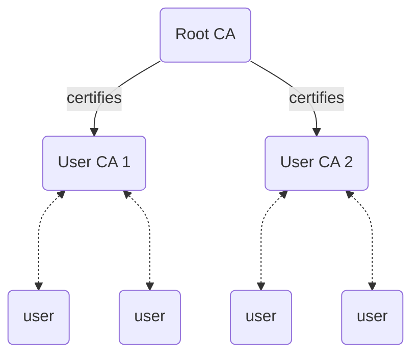

# Term-Certificate Authority (CA)
In a PKI system, each user registers their public-key with a centrally trusted **Certificate Cuthority (CA)**. The user must prove ownership of their public-key, which they may do by [[Topic-Signatures|signing]] a message. The CA returns a certificate, the CA's own signature of the user's public key. The user may then demonstrate ownership of their public-key by showing the certificate to other users.

To reduce risk that a CA may be compromised, PKI systems maintain several levels of CAs. The top root-level CA issues certificates for lower-level CAs. The lower-level CAs interact with users. Users may check that the lower-level CA is still trustworthy with the root CA.

---
## Related Pages
*The related pages section is for linking this page other the rest of the graph, press F11 for details. If applicable, replace the following dummy links.*
- primary-topic:: [[Topic-Public Key Infrastructure (PKI)]]
- secondary-topic:: [[Topic-Authentication]]

## External Resources
- Wikipedia:: [Certificate Authority](https://en.wikipedia.org/wiki/Certificate_authority)

