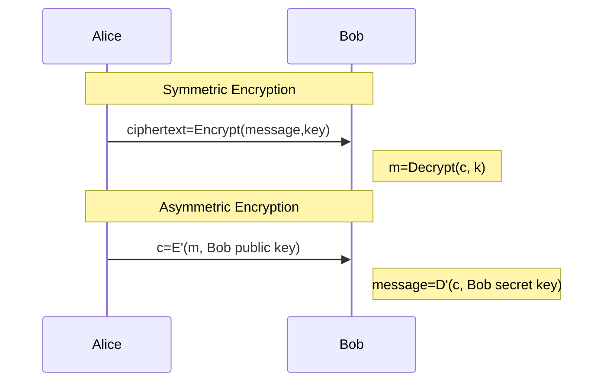

*last-modified (only renders within Obsidian with Dataview installed): `$= dv.current().file.mtime`*
# Topic-Encryption

**Encryption** and decryption is process of algorithmically hiding and unhiding information. Cryptography terms the original message the [plaintext](https://en.wikipedia.org/wiki/Plaintext), and the encrypted message [ciphertext](https://en.wikipedia.org/wiki/Ciphertext), [cipher](https://en.wikipedia.org/wiki/Cipher) being the historical word for a [[Topic-Symmetric Encryption|symmetric encryption algorithm]]. Encryption is often described in a message passing context between two parties, but includes the hiding of static information, as in the case of [Disk Encryption](https://en.wikipedia.org/wiki/Disk_encryption) .

Encryption can be broadly categorized into two categories: symmetric encryption and [[encryption/asymmetric encryption/Topic-Asymmetric Encryption|asymmetric encryption]] (public key encryption). Symmetric encryption algorithms require both the encrypter and decrypter to have access to the same information, a shared key. In asymmetric key cryptography, the receiving decrypter holds a secret key (known only to the decrypter), while the encrypter uses the receiving party's public key (which may be published online, or distributed in any way). 

Symmetric key encryption is at least as old as Julius Caesar, who was said to use a rotation cipher, termed the [Caesar Cipher](https://en.wikipedia.org/wiki/Caesar_cipher), to conceal his messages from enemy soldiers circa 69 BCE[^1].

Asymmetric Key encryption is a significantly more recent invention: it was simultaneously conceived of by [James H. Ellis](https://en.wikipedia.org/wiki/James_H._Ellis) of the British intelligence agency GCHQ between 1970-1974, and by [Whitfield Diffie](https://en.wikipedia.org/wiki/Whitfield_Diffie) and [Martin Hellman](https://en.wikipedia.org/wiki/Martin_Hellman) in their 1976 paper [New Directions in Cryptography](https://ieeexplore.ieee.org/document/1055638). The discovery by GCHQ was not disclosed until 1997[^2].

---
## Related Pages
*The related pages section is for linking this page other the rest of the graph, press F11 for details. If applicable, replace the following dummy links.*
- primary-topic:: [[Topic-Cryptography]]
- context:: \[\[context\]\]

## External Resources
*The sources section is for recommending resources on other sites*.
- Wikipedia:: [Encryption](https://en.wikipedia.org/wiki/Encryption)

## References
*This section is for citations of any claims made in the page*.
[^1]: [Suetonius, Vita Divi Julii](http://thelatinlibrary.com/suetonius/suet.caesar.html#56)
[^2]: [GCHQ: James Ellis](https://www.gchq.gov.uk/person/james-ellis)