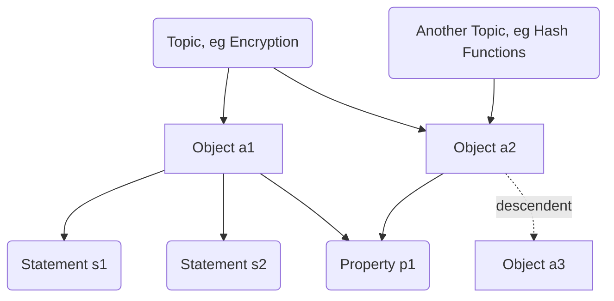
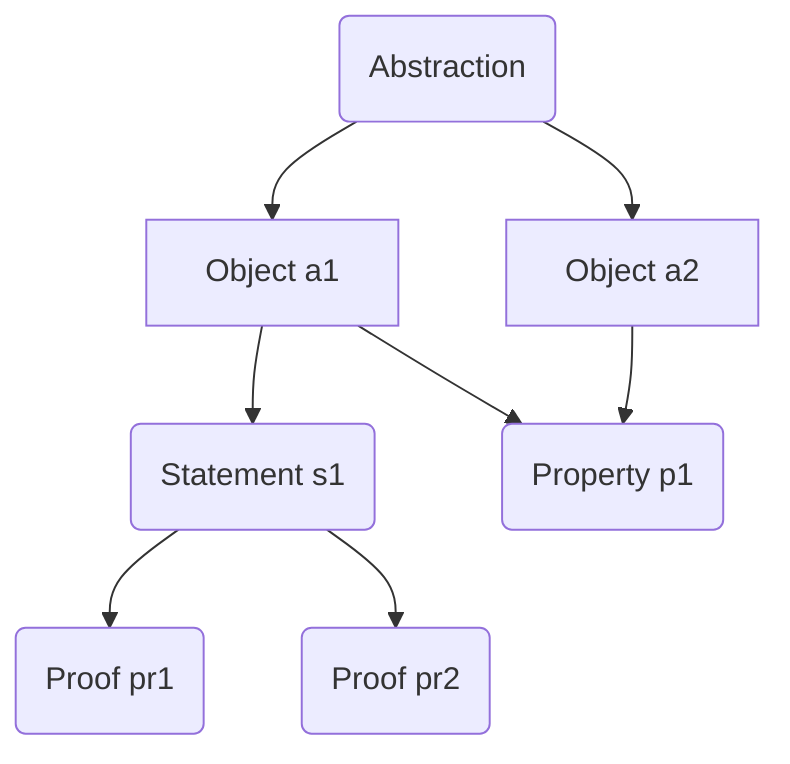
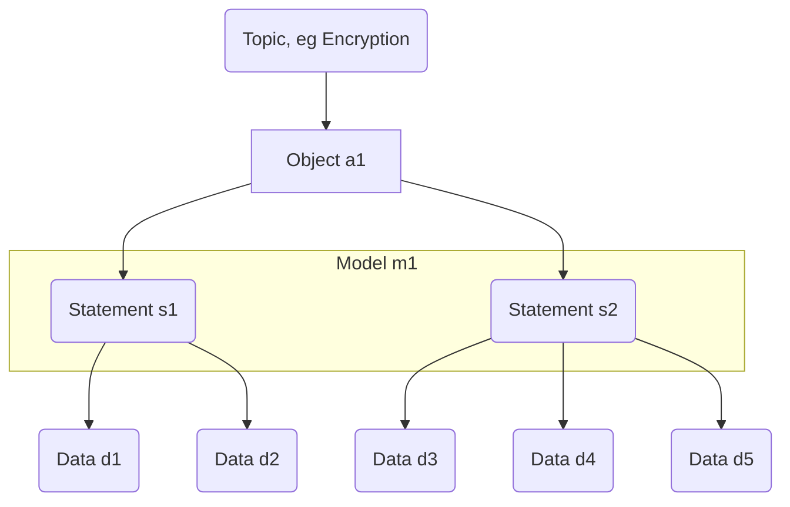

# Explanation-Node Categorization
This page is out of date and will be removed soon.

The following node categorization attempts to simultaneously satisfy [a priori and empirical traditions](https://en.wikipedia.org/wiki/A_priori_and_a_posteriori) while serving the needs of researchers and practitioners. *Readers unfamiliar with the distinction between a priori and empirical models are encouraged to read the prior link introduction and example; the distinction is expanded on throughout the note*.

The categorization system aims to achieve **simplicity, extensibility, flexibility, and intuitive legibility** in representing the knowledge dependency graph. 

Reading the following section should be sufficient to understand the Uncloak model for graph categorization. 

## Basic Node Categories
Each node will belong to one of the following categories. What follows is a short description of each category; a more in depth discussion and definition of each category will eventually be written.

There are presently **four** universally important node types for describing knowledge. **Statements**, **objects**, and **properties** are the atomic components for describing the knowledge-stuff, while **topics** give context for how the knowledge-stuff is generally organized and sourced.
- **Statement**: nodes that express some claim about some other node (possibly another statement). Statements are analogous to verbs. Important claims are likely to live on their own node, less important claims may live inside other nodes. Statements in the a priori tradition may be **proven or disproven**. If the a priori tradition is inapplicable, or unable to deliver a result (conjecture), we may default to the empirical tradition, where statements lie somewhere on the **spectrum from completely refuted to overwhelmingly supported** by data. **Data** is its own node type, as are **proofs**, see below. A statement may be **synthetic**, if the statement lies within both traditions. Empirical statements may be grouped together in **model** nodes.
- **Object**: nodes that describe things of interest. Objects are distinct from the statements and models that describe them, though these descriptive statements may live on an object node, and/or on adjacent statement nodes. Objects are often composed of other objects. Objects are analogous to nouns. The empirical tradition tends to work with **physical objects:** particles, phenomena, granite, radio waves, atoms, quarks, etc., while the a priori tradition tends to work with **propositional objects:** the trivial group, Euler's totient function, the Euclidean algorithm, the GKR protocol, linked lists, the set of natural numbers, the number zero.
- **Property**: nodes that describe features that a set of objects may have. Properties may be prescriptive or descriptive; they are more likely to be descriptive for **physical objects**, but prescriptive for **propositional objects** and **abstractions**. Properties are analogous to adjectives. 
- **Topic**: effectively, containing categorizations for groups of nodes. Categorizations tend to be messy and may lack consensus; how to best represent this is an important question to answer, but our simple answer is to allow that **nodes may belong to more than one topic**. Topic nodes should serve as starting points for exploration of an area: they should describe important elements within the topic, and suggest paths through the topic for different audiences. The **root node** of a graph is a topic node. Every non-root node in the graph *must* include a dependency edge back to one or more (not entirely overlapping) topic nodes. The **root node** of a graph is the containing topic of all other nodes. 

Starting with these basic node types, we might begin to imagine a graph looking something like this:

With just a basic language for organizing the structure of knowledge, we can already begin to organize the relations between concepts in non-linear ways. The structure demonstrates that we may organize concepts into fields of study, which contain principal objects, about which we observe statements and properties. But we don't yet have a node type for demonstrating that a statement is true!

There are two ways that we typically investigate whether a statement might be true: 
- we may prove the statement from first principles (a priori reasoning)
- we may collect evidence about the statement, do experiments, and consider its probability of being true (empirical reasoning)

We can represent these two approaches to knowledge construction with a few new node types. In the a priori approach, we may add:
- **Proof**: nodes containing a proof of an a priori statement. For statements possessing only a single proof, an extending proof node is generally unnecessary, though there are statements possessing dozens or even hundreds of independent proofs. For these, the statement itself should highlight the most important proof or proofs and categorize the others while the proofs themselves are moved out to independent nodes.
- **Abstraction**: a set of objects prescriptively defined by a goal, or set of axioms. Algebraic structures like groups, rings, modules, fields, and categories are abstractions. The set of algorithms for finding primes is an abstraction over any particular algorithm. Complexity classes are abstractions. *This element could use some scrutiny*.

Returning to our example, we might include a proof directly on the Statement s1 node, or we can show that statement s1 has multiple proofs. We might also represent an abstraction over objects a1 and a2.

The following node categories are particular to the empirical approach to knowledge generation.
- **Model**: nodes that unite a set of **empirical statements** into a single model. In the empirical tradition, a model is a collection of related statements, typically about some object. Whether a statement actually belongs within a model may be disputed; the graph representation may represent this by weighting *inclusion edges* between models and statements. 
- **Data**: Empirical evidence supporting or rejecting a hypothesis are represented as data nodes. Some types of data include experimental results, natural phenomena, and events. A note on collision: natural phenomena may be considered as an object of consideration in itself, or as data toward a hypothesis. *this category distinction is currently unclear, but suggests that data may overlap objects in unpredictable ways.*

Now we can group statements s1 and s2 together as a **model**, and gather evidence supporting or refuting the statements.

Organizing knowledge in this way gives a clear visual structure to demonstrate how we actually know that things are true. In the Uncloak graph, the structure is navigable with an interactive UI element.

But in addition to clarifying the structure of how knowledge is *generated*, we may also use the graph approach to clarify how knowledge is *organized and used* by practitioners. To the end of making the graph useful for learners and practitioners, we introduce several further node types:
- **Tool, Library**: Nodes dedicated to particular tools, software libraries, and methods. Tool nodes aim to describe the tool, field of application, maturity, and relevant alternatives. More complete comparisons between tools may be given in **context** nodes. In addition to explanation, tool nodes may include [how-to guides](https://documentation.divio.com/how-to-guides/) on how to use the tool. Tool nodes should point at a set of object nodes, or a field node. **Tutorial** nodes are related, but focus more on the achievement of some goal than the description of some tool or method.
- **Tutorial**: Nodes dedicated to demonstrating how to achieve some goal. The inclusion of tutorials is an intentional departure from the Encyclopedia model. Sites like [Hackaday](https://hackaday.com/) and [Instructibles](https://www.instructables.com/) demonstrate the value in community sourced and maintained tutorials for technical practitioners at all levels.
- **Aphorism**: Nodes describing well-known principles, heuristics, sayings, rules of thumb, and generally, advice. The advice need [not be good or even correct](https://en.wikipedia.org/wiki/Security_through_obscurity), but should be generally recognized by the field. 
- **Project**: Nodes describing institutions, labs, companies, and particular efforts. Projects can serve as examples for application areas of otherwise theoretical knowledge. *We'll eventually have to come up with rules preventing these from turning into marketing cesspits*.
- **Comparison**: Nodes aiming to make comparative analysis of a particular set of nodes, resources, or approach. Lists, flowcharts, tables, charts, etc.
- **Meta**: Nodes for self-referential pages, about the approach of this project.
- **Other**: For elements not anticipated. Some fields may require entirely other node types, though the basic coverage given here should be extensible to cover most other use-cases.

There is explicitly **not a node type for people** (or places). References to other sites describing people will be allowed, but nodes on people [distract from the site purpose and invite vandalism](https://en.wikipedia.org/wiki/Wikipedia#Vandalism). 

Anticipating some likely questions, what constitutes something *important enough* to deserve its own node? What if a crap node that doesn't closely obey rules gets proposed and accepted? 

Inevitably, users will propose all sorts of content as potential nodes. Some crap nodes will exist, and may not closely follow the rules laid out here. This is fine. Crap nodes will inevitably have low engagement and participation, and we can weight these nodes as less important. Users may identify crap nodes as crap, and propose their deletion, or improve the node beyond the point of its being crap. Further, it is sometimes hard to differentiate between crap and a developing research direction, which suggest that the site should lean toward permissiveness of [type II errors](https://en.wikipedia.org/wiki/Type_I_and_type_II_errors). 

The above is a sufficient explanation of the different types of nodes for most readers. The remainder of the article gives further discussion on a priori versus empirical approaches to structuring knowledge.

\<todo: put example picture of zk graph here when one exists\>

## On A Priori and Empirical Approaches
The author of this article immediately admits that he is neither an expert on metaphysics nor in empiricism. This discussion is intended to communicate the current perspective on the intersection of empirical and a priori approaches to knowledge.

In the following discussion, I present a pair of object models and contrast them, to demonstrate directions for effective graph development in both knowledge traditions.

### Similarity and Divergence
Constant in both approaches is the primary importance of **objects** and **statements**. Though the subject matter may vary, the identification, exploration, and study of objects seems appropriate as a model for all technical disciplines that I have considered. 

**Propositional objects** (algorithms, data structures, functions, sets, etc.) are defined by logical construction, while **physical objects** (particles, phenomena) are either obviously physical entities, or representative of a model for physical interaction (eg waves). The framing that these are *fundamentally similar*, in that they are expressible as objects, is a core insight. It simultaneously allows provable and unprovable (but empirically supportable) statements to be made, even *about the same objects*. This allows objects to serve as intermediary between the empirical and a priori traditions, even as they broadly diverge in other directions. Without a bridging concept for the two traditions, it would be impossible to simultaneously represent both traditions in the same graph.

This is both an important, and somewhat obvious-in-retrospect insight, in that there are no other reasonable candidates for structured overlap between the two traditions. Methods for demonstrating the truth of statements are typically mutually exclusive between traditions. While the a priori tradition pursues ideal abstractions over propositional objects, the empirical tradition pursues increasingly accurate models for physical objects. The a priori tradition has little use for data, except where it may be put to use in proofs; the empirical tradition lives and dies by the capacity to recognize and prevent [systemic data bias](https://en.wikipedia.org/wiki/Replication_crisis).

Keeping objects constant, approaches to constructing and validating statements across the two traditions generally diverge: for any statement, either a proof exists, or it's unclear whether one exists, and we need to collect data. A priori statements and their proofs tend to build on one another, toward a propositional cathedral of statements building on other statements, sometimes in unexpected ways from across disciplines. The a priori approach to increasingly tower abstracting objects over one another makes for tall, complex networks of objects, statements, and abstractions.

Statements in empirical disciplines only rarely rely on other statements as evidence; more common is that several statements may rely on a particular data element as shared evidence. Unlike a priori fields, a single element of data is rarely overwhelming evidence, while a single proof is all a propositional statement requires to be regarded as *proven*. Statements in empirical fields may have several, even dozens of independent elements of data supporting, contextualizing, and refuting their validity. Statements in empirical fields are likely to have competing alternative hypotheses. Finally, empirical statements are likely to be grouped together into **models**, which may also compete with one another.

\<todo: put example picture of an a priori map here when one exists\>

\<todo: put example picture of an empirical map here when one exists\>

## On the advantages of keeping a low bar for "is this statement significant enough for its own node?"
There are many, particularly for priori statements, where insignificant lemmas tend to modularly build on one another into significant theorems. A dependency graph is the best possible substrate for representing that structure. 
Todo: Say more, give visual example. 

There should be a much higher friction barrier for proposing new elements and structural changes at the base of the tree, than for frontier probing researchers to proposing elements in the branches and leaves. This is an analogy to the researcher meta of trying to attain many citations: researchers who build a frontier of the tree that attracts further attention and effort have won at the researcher status game of "contributing something interesting" (and in a much more tangible way than chasing citations).
Todo: expand.
