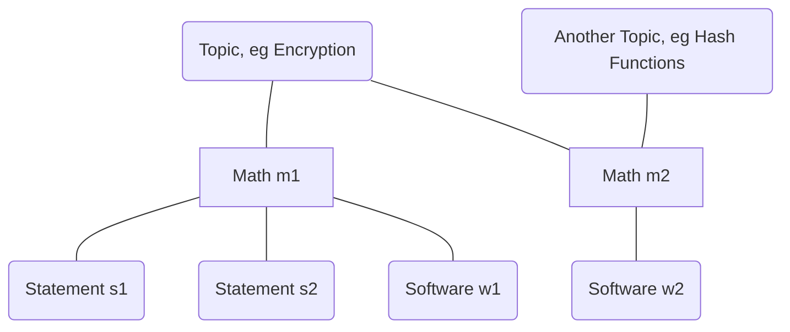

# meta-Uncloak Contributor Guide
This document is intended to help contributors get up to speed on where and how to contribute. Press `F12` at any time to open this page while within Obisidan.

## Getting started
[Fork](https://github.com/thor314/uncloak/fork) the [repo](https://github.com/thor314/uncloak) and edit in a Markdown editor of your choosing. Open a pull request when your contribution is ready for review.

**Contributions of all sizes are welcome**. Easy areas for first contributions include suggesting resource links, citations, and fixing typos. Many pages are empty stubs with a link to another resource, often Wikipedia. Suggesting content for stub pages is a great way to help out. We don't currently have the resources to check your suggestion for plagiarism, but **please don't copy-paste from another site**.

If your intended contribution is small-to-medium (fixing a typo, suggesting a resource, adding content to a page), you already have everything you need to start, the rest of the guide is directed at how we think about structuring site content.

If you'd like to make a larger contribution to an area of site content that doesn't yet exist, you **might consider opening an issue first** to describe the contribution you intend to make so that we can discuss how we can structure your contribution into the graph.[^1] If you intend to propose **more than one new node addition** to the graph, we prefer that you structure your contribution into several pull requests:
- PR $N=1$: propose new stub nodes (**stub** means with little or no content), and their connections to one another. Opening an issue to discuss this structure before the first PR helps us avoid wasting your time.
- PRs $N>1$: Add content updates to your stub nodes. It's alright if your subsequent PRs continue to introduce new nodes and edges that you hadn't yet considered, but we continue to recommend first proposing stub nodes for discussion in PR $N=n-1$ before fleshing out contributions in PRs $N\ge n$.

You are free to use whatever Markdown editor you would like. The Obsidian application is easy to start with, and comes with convenient tools for creating new pages from templates, linking pages together, and generally working with Markdown documents. The github includes a pre-configured Obsidian set-up (see the `.obsidian` directory) that you may use.

## On Node Types
Uncloak's primary difference from other wikis and knowledge vectors is the emphasis on **communicating the dependency structure of knowledge** via the graph. To achieve this, we have developed a categorization typology for nodes and edges. Each node type has a [template](https://github.com/thor314/uncloak/tree/main/templates), specifying what to include in each type of node. Our node typology attempts to cover all concepts that may arise in the study of cryptography. We have attempted to allow our system to be flexible enough to be encompassing, while remaining legibly obvious to a casual user.

### Basic node types
Cryptography descends from Computer Science and Mathematics; our typology attempts to be generally flexible, but would not serve all scientific disciplines equally well!

These are several primary node types in our graph:
- **Topics** group together other pages (including other topics). Topics are non-exclusive: a page may belong to more than one topic, but each page identifies a **primary topic**. Each topic gets its own subdirectory. Each page lives in the subdirectory of its primary topic. Topics may have many links, but a topic with more than 50 links may be worth separating into further sub-topics. Unfortunately because of the Obsidian graph limitations, nodes with many links quickly become visually messy.
- **Object** nodes are the "main characters" of the graph.
    - **Mathematical** objects are concepts that a mathematician might work with. They tend to be Platonic in the sense that they are "discovered" as much as they are "invented". There is a growing list of math node subtypes: functions, algorithms, sets, algebraic structures, and complexity classes, for a start.
    - **Software** objects describe code and techniques used in software. Software nodes give descriptions of existing libraries, binaries, tools, data structures, DSLs, etc.
    - **Physical** objects are physically occurring stuff. This includes man-made objects (hardware, physical tools) and naturally occurring physical objects, though cryptography generally has less to say on the latter.
    - **Phenomena** objects are a catch-all category for interesting stuff that happens. It's not yet well considered how phenomena objects will be used, but it seems important to include them as a possibility.
- **Statements** nodes make claims about objects. Statements are *complex*: there are many kinds of statements we might like to make.
    - **Provable** statements have proofs (or disproofs). Theorems, propositions, lemmas, and conjectures are common characters in mathematical cryptography. Conjectures in this system are treated as empirical statements. Also see **proof** in the next section.
    - **Empirical** statements have some degree of supporting or rejecting evidence. They may also be lacking evidence in any direction. Also see **data** in the next section.
    - A **Model** groups together a *set of statement nodes* (typically empirical statements) into a coherent structure. Security models and simulations are examples of models.
    - **Aphorism** statements are commonly known truisms or advice, e.g. "don't roll your own crypto" and Kerckhoffs's Principle.
    - **Property** statements describe significant features of some object, e.g. the divisibility of the integers.
    - You might observe that we make statements all the time, on all types of nodes! Not every statement deserves its own node, though our bar for what deserves a statement node is not high. Much of mathematics is constructed from a towering architecture of relatively trivial statements, stacking on top of one another. That it is not already common practice to represent this structure with a graph is a colossally wasted opportunity!

Starting with just these basic node types, we might begin to imagine a graph looking something like this:


With just a basic language for organizing the structure of knowledge, we can already begin to organize the relations between concepts in non-linear ways. The structure demonstrates that we may organize concepts into fields of study, which contain principal objects, about which we observe statements and properties. But we haven't yet discussed node type for describing whether a statement might be true!

### Statements have Truthiness
As described in the section on Statements, there are two epistemic ways that we might show something is true or false: by **proof**, or by accumulation of **data**.
- **Proofs** are propositional sequences of logic, potentially drawing on other statements in the graph. If the proof of a statement is simple and draws on little, then there is little extra cost in including the proof on the statement itself. But if the proof is complex, it may draw on many other statements; separating the proof from the statement then clarifies the total relation. Further, there may be multiple proofs for any given statement. By separating proofs from statements, we enable a proof to more clearly demonstrate its network of linkages to other statements, while allowing statements to possess a multitude of proofs.
- **Data** is supporting, rejecting, or otherwise relevant evidence in connection to some statement. In cryptography, there are fewer examples of "data" than in other scientific disciplines, but we often analyze protocols under security assumptions and security models that are only conjectured to be secure. A piece of *data* supporting these assumptions might be the number of years that the assumption has held.

With just these node types, we have all we need to start building our knowledge graph. But we aren't quite done. There's one final node category worth discussing, and that's context.

### Context, the Knowledge Envelope
Even with a graph, the context of a node can be difficult to parse. Context is the envelope around nodes that helps clarify relationships, highlight paths through the graph, and consider human effort in the process. The umbrella of context includes definitions of **terms**, **comparisons** between tools and other objects, **pedagogical** content, as well as human efforts like **projects**, **companies**, and **schools**.

Context pages are important, but pretty straight-forward. They don't require much explaining, so we refer you to the [[meta-Node Type List|full list of node types]], while we move onto the next section.

But a quick note before we move on: nodes on **People and Locations are explicitly excluded** from the graph, at least while the project focuses on more pressing pages. Links to people pages on other sites is allowed, but nodes on people and locations [distract from the site purpose and invite vandalism](https://en.wikipedia.org/wiki/Wikipedia#Vandalism).

### How node type is indicated
Each page has a YAML front-matter metadata area at the top of the page. We use **tags** to indicate both node type, and node topic. Eg for a page on a zk-circuit compiler:
```
---
creation-date: 2022-10-22 14:45
tags: type/object/software/programming-language/compiler, topic/zero-knowledge/circuit-compiler
---
Page starts here.
For contextual clarity, an indicator of node type is the first word of the title.

# compiler-Title
```

Tags can also be included with a hashtag \#like/this, but we will prefer to keep tags in the format demonstrated above. Don't include spaces in tags, use dashes instead, as demonstrated above.

## On Edge Types
Edge types are much simpler than node types. Links within a page imply an undirected relationship between nodes.
- Link to nodes within the graph with double square brackets: \[\[A link to a node with this name\]\]. Links allow the user to **hover over the link to get a preview of the page** without clicking away.
- Change the description of a link with a pipe: \[\[name of node|display this text\]\]. Prefer to use piped descriptions when linking to other-pages inline within a the body of a page. Don't use piped descriptors the Related Pages section, do use them when writing inline links.
- Link to external pages with normal Markdown links: \[some human descriptor\]\(some link\)

Links are assumed to be undirected edges. Obsidian does not yet provide flexible tools for manipulating link directions. On the local Obsidian client, link direction is recognized by the graph; but on the website, all links in the graph are undirected edges.

The Related Pages section at the bottom of each page is where we explicitly label and categorize edge types. The Obsidian Publish site does not currently have a way to reflect this information in the graph, but we may implement more flexible graph features in the future.

See [[meta-Related Pages Edge Types List]] for a working list of all edge-types.

## Norms
This section is a work in progress.
The following list of norms outlines some site norms we ask contributors to follow.
- Please do not plagiarize. We do not have the resources to check your contribution against the rest of the internet.
- Follow the templates outlined in the template directory. Templates exist to suggest structure for each page, and to be extended. You are welcome to extend them.
- While writing, try to cite your sources with footnotes. An inline footnote looks like this (without the grave quotes):`[^2]`. Drop them anywhere into the text, and append under references the text `[^2]: <a link to your source>`. See [Topic-Encryption](https://uncloak.org/encryption/Topic-Encryption) for examples.
- Note that the site is limited to 4GB of image content. Take advantage of native markdown features like LaTeX and [Mermaid](https://mermaid-js.github.io/) to create pages with rich examples in preference to including images, though you may include images if the situation justifies. If you would like to include an image from a tool that is not yet supported by the site (eg. Tikz), take a screenshot of the output, and include the code for the image in a footnote.
- Don't link to external pages within the body. The External Resources section is the right place to include external links. If the site should describe some concept, but the concept doesn't yet exist, link to it as a sort of todo indicator like this: \[\[Term-TERMNAME|TERMNAME\]\]
- Terms and topic pages are your structure friends.
    - Terms are short notes giving a couple sentence description of a technical term, so that a page's flow may continue uninterrupted. Users may hover over terms if they are unfamiliar. Terms may eventually be upgraded to another page type with more detail, but term pages tend to be the easiest type of page to to write, maintain, and link to.
    - Topic pages are the primary way site content is organized. Topics are isomorphic to the directory structure: for every topic, there is a directory, and vice versa. Topic pages are also *Map of Contents* pages, backlinked to by every page within the topic. Topic pages should help readers understand some order to the topic area, how to approach the topic, what pages to visit and in what order. As a topic area grows, so should it's topic page. A topic that becomes unwieldy may be worth splitting into sub-topics.
- Changes to this git repository do not automatically push to the site. This has to be done manually, until we get around to automating it.

## On Using Obsidian
This section is a work in progress.
The `.obsidian` directory in the Uncloak repo contains a preconfigured setup that you may use. If you aren't comfortable with vim keybindings, press `Ctrl-,` and disable the setting at the bottom of the editor section.

To create a new note, `Ctrl-N` to choose a template, and `Alt-R` to refile it to the correct location.

You can do this automatically create footnotes with `Alt-F`, which inserts a footnote for you, drops you to the end, and jumps back to where you were when you press `Alt-F` again. If footnotes become unsorted, use `Alt+Shift+F` to tidy the footnotes.

I've written a longer guide on getting started with Obsidian for personal use elsewhere: [A template repo, with instructions for getting started with Obsidian](https://github.com/thor314/obsidian-setup).

To be expanded.

## Rest of contributor guide is under construction!
Hopefully that's enough to get you started. We intend to expand this guide in the future as the site grows. Feel free to drop us feedback on how to improve this guide.
- document the metadata
- outline approach for different audiences
- more on using obsidian
- [[meta-Obsidian Setup Choices]].

## Related Pages
- primary-topic:: [[topic-Meta]]
- related:: [[meta-Node Type List]]
- related:: [[meta-Related Pages Edge Types List]]
- related:: [[meta-Obsidian Setup Choices]]

[^1]: We care a lot about the structure of connections between the atoms of knowledge! We've chosen to use Obsidian Publish for our site to demonstrate the dependency graph of concepts, as we believe that communicating structure is as important for a wiki as the individual node content.