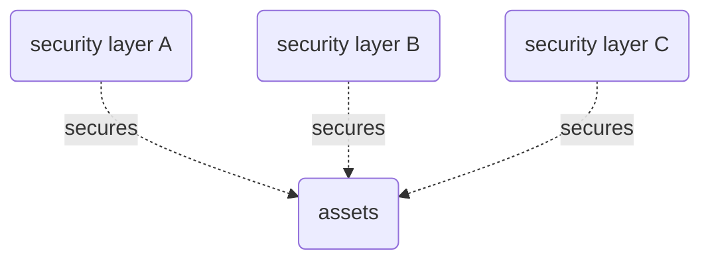

# Term-Defense in Depth
In security, a system with defense is a system that requires an attacker to break through several layers of security measures before the system is compromised. Examples include doubly-encrypting messages in different cryptosystems, routing packages through many [[Term-Onion Layer|onion layers]] in a mixnet, or using [[Hardware-Secure Enclave, Software Guard Extensions (SGX)|secure enclaves]] to perform private computation on a machine with other security  security measures.

*an attacker must break components A, B, and C to compromise the system. This is defense in depth.*

*An attacker may break any component, A, B, or C to compromise the system. This is the opposite of defense in depth.*

---
## Related Pages
- primary-topic:: [[Topic-Computer Security]]

## External Resources
- Wikipedia:: [Defence in depth](https://en.wikipedia.org/wiki/Defence_in_depth)